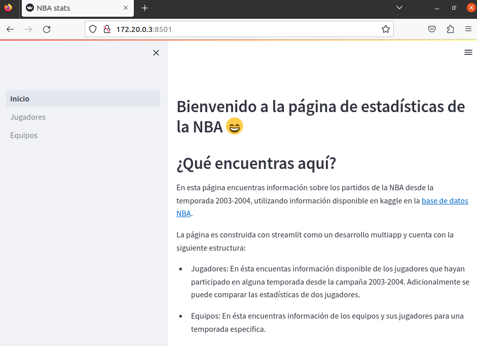
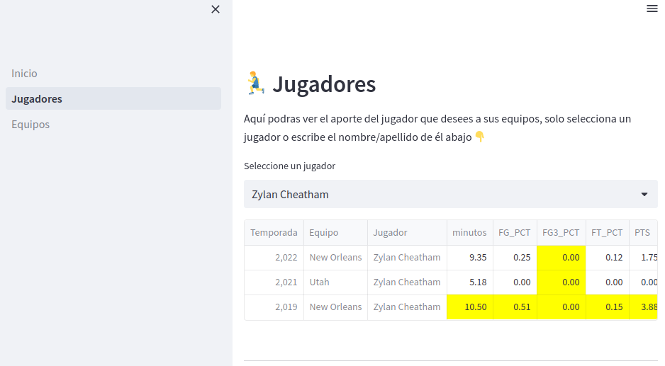
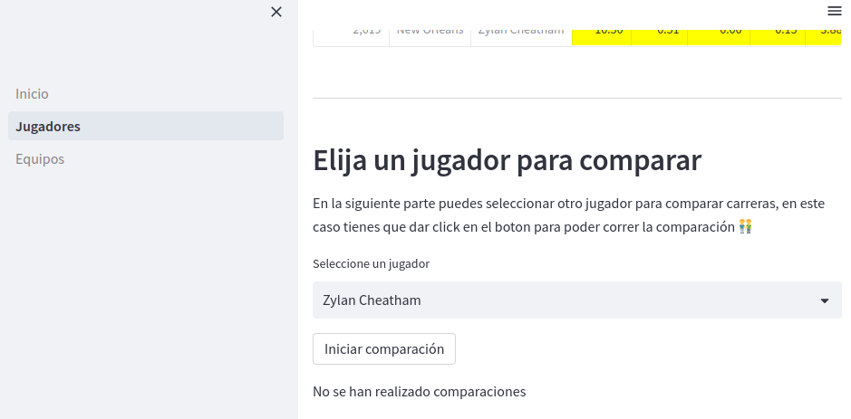
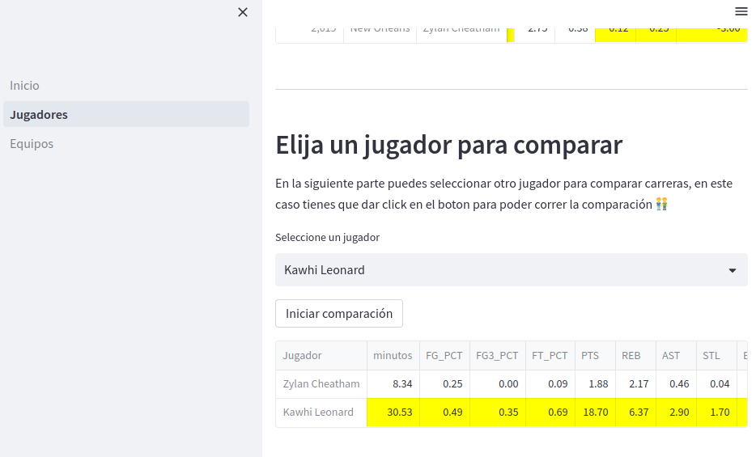
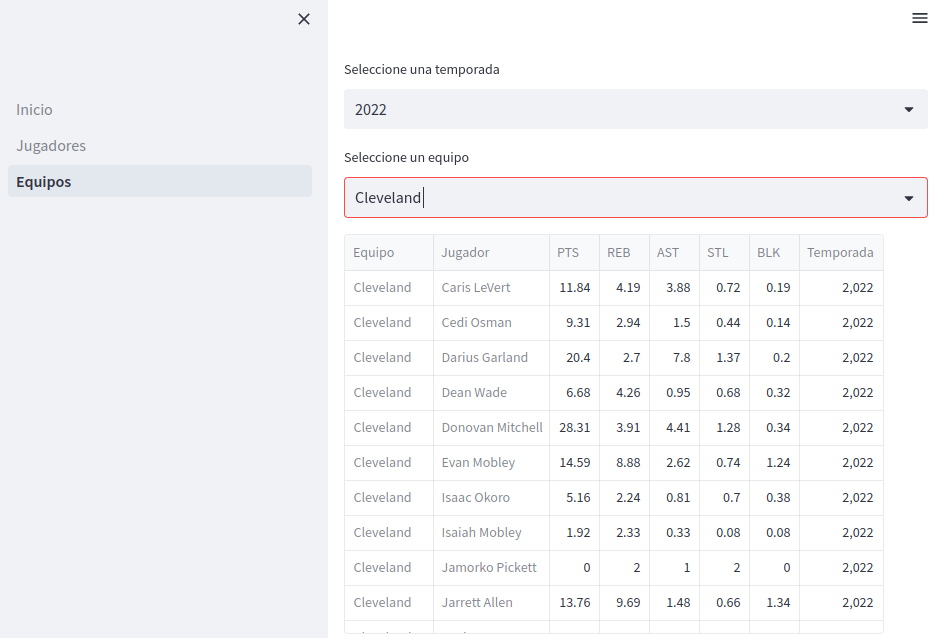

# NBA Streamlit
En este repositorio guardaremos los códigos y demás desarrollos sobre la base de kaggle NBA, [base de datos NBA](https://www.kaggle.com/datasets/nathanlauga/nba-games).

## Requisitos
Para el despliegue de la herramienta desarrollada en streamlit, se necesita tener instalado docker para hacer uso de los archivos dockerfile y docker-compose.yml. Con estos archivos se despliega una imagen de MySQL 8.0.33 con la base de datos de la NBA y una imagen python 3.8 que hace uso de esta base para desplegar funciones de consulta y presentación en tablas.

## Despliegue
### Clonar el repositorio
Para ejecutar los comandos necesarios para tener el repositorio en local, se puede usar git-bash o si se posee un sistema basado en unix (MacOS y Linux) se pueden ejecutar los comandos desde la terminal.

Para clonar el repositorio se puede hacer uso de los comandos:

`git clone https://github.com/Daniel-c759/NBA_streamlit.git`

o si bien se tienen configuradas llaves SSH se puede usar:

`git clone git@github.com:Daniel-c759/NBA_streamlit.git`

### Configurar

Dentro de la carpeta NBA_streamlit que genera al clonar el repositorio, entramos a la carpeta app/ en la cual debemos crear una carpeta **.streamlit/**. Dentro de esta última carpeta, es necesario crear un archivo **secrets.toml** con la siguiente configuración:

```
# .streamlit/secrets.toml

[connections.mysql]
dialect = "mysql"
host = "db"
port = 3306
database = "NBA"
username = "root"
password = "daniel97"
```

### Iniciar los contenedores Docker
Desde la interfaz de linea de comandos (CLI por sus siglas en inglés) de Docker, nos dirigimos a la carpeta NBA_streamlit mediante el uso del comando `cd`. Una vez dentro de la carpta podemos listar los archivos con el comando `ls`, con el cual encontraremos el archivo docker-compose.yml. Para hacer uso de este archivo, en la carpeta procedemos a realizar el siguiente comando:

`docker compose up`

Si por alguna razón se necesitan permisos de administrador, en los sistemas basados en unix se puede hacer uso del comando `sudo` de la siguiente manera:

`sudo docker compose up`

### Abrir url correspondiente
Una vez iniciados los contenedores, se nos presentara el siguiente mensaje en consola:

> You can now view your Streamlit app in your browser.
> Network URL: url1
> External URL: url2

## Visualización



Lo primero que encontraremos es la pantalla de inicio de la herramienta, en está se observa que en el panel de la izquierda están las opciones disponibles, mientras en la parte central de la página se ve una breve descripción de lo que se puede encontrar en la herramienta.

### Página de jugadores

En está página encontramos una tabla en la que se resume por temporada estadísticas de un jugador que el usuario puede seleccionar entre aquellos que han estado en alguna temporada en la NBA desde el 2003. En la tabla, las estadísticas que se presentan son:

* Minutos por temporada
* Porcentaje de campo por temporada (FG_PCT)
* Porcentaje de triples por temporada (FG3_PCT)
* Porcentaje de tiros libres por temporada (FT_PCT)
* Puntos (PTS)
* Rebotos (REB)
* Robos (STL)
* Asistencias (AST)
* Bloqueos (BLK)
* Diferencia en puntos obtenida cuando el jugador está en cancha (mas_menos)



Igualmente, se desarrollo una opción para comparar dos jugadores y sus trayectorias en la liga. Para ambas tablas, se da un formato condicional para resaltar la mejor marca por estadística




### Equipos

En la página de equipos, se puede extraer por temporada y equipo el desempeño de los jugadores asociados a éste, mostrando:

* Puntos (PTS)
* Rebotes (REB)
* Asistencias (AST)
* Robos (STL)
* Bloqueos (BLK)
* Temporada


